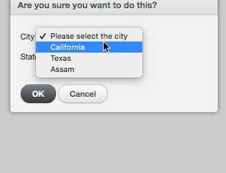
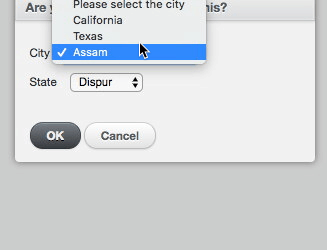

# 레일즈 개발 및 액티브어드민 개발 헬퍼

* <a href="#email_confirm_code">이메일 인증코드로 회원가입 구현하기</a>
* <a href="#user_registration_process">회원가입 프로세스 구현하기</a>
* <a href="#current_user_json">모델 관련 데이터 json화 및 사용</a>
* <a href="#active_admin_user_list">액티브어드민 리스트 원하는 개수 정렬</a>
* <a href="#active_admin_select_download">액티브어드민 선택한 항목만 CSV 다운로드 하기</a>
* <a href="#js_city_state">액티브어드민 배치액션 폼에서 city-state js로 구현하기</a>
* <a href="#image_direct_upload">이미지 즉각 업로드</a>
* <a href="#imageviewer">js로 이미지 뷰어 (확대 가능)</a>
* <a href="#ransack">액티브 어드민에서 ransack 으로 필터 자유자재로 구현하기</a>
* <a href="#tinymce">액티브 어드민에서 tinymce (wysiwyg editor) 이미지 업로드 까지 구현하기</a>

---

<h2 id="email_confirm_code">이메일 인증코드로 회원가입 구현하기</h2>

이메일 인증에 있어서, 특정 인증코드를 발송해주고 해당번호를 입력해야만 정상정으로 서비스를 이용할 수 있게하는 기능입니다.  

일단 devise에 이메일 인증 기능은 구현되어있다는 가정하에   

먼저 간단하게 이메일 인증하기 버튼과 인증번호를 받을 수 있는 폼을 만들어 줍니다.

~~~c
<%= f.email_field :email %>

<a id="confirm_code" href="#" class="button">이메일 인증하기</a>

<input type="text" id="user_code" value="" placeholder="인증번호">
~~~
  

그리고 인증코드를 관리해줄 테이블을 생성해주도록합니다.

> rails g model ConfirmCode email:string code:string confirmed_at:datetime
  

이후에 코드와 이메일의 고유성을 위해

~~~c
add_index :confirm_codes, :email
~~~
를 추가해주고  

> rake db:migrate
  

이후에 ConfirmCode.rb에 코드를 아래와 같이 구성해주었습니다.

~~~c
class ConfirmCode < ApplicationRecord
  validate :exist_user_email! // 이미 가입한 유저인지 확인

  VALID_EMAIL_REGEX = /\A[\w+\-.]+@[a-z\d\-.]+\.[a-z]+\z/i  // 이메일 문자열 검사
  validates :email, presence: true, format: { with: VALID_EMAIL_REGEX }  // 이메일 validate

  def exist_user_email! // 이미 가입한 유저인지 확인
    if User.find_by(email: email).present?
      errors.add(:email, :exist_user)
      puts "이미 존재하는 유저입니다."
    end
  end

  def self.gen_code(email) // 인증코드를 생성해주는 부분
    confirm_code = self.find_or_create_by(email: email)
    if confirm_code.update(code: rand(1000...9999))  // 1000~9999 중 랜덤하게 (코드는 임의로 더 복잡하게 바꿀수도 있습니다)
      UserMailer.generate_code(confirm_code).deliver_now  // 유저에게 이메일로 코드를 보내주는 부분 (이미 구현 되어있다 가정)
      return {result: true, code: 0, message: "가입할 수 있는 이메일 주소입니다. \r\n 인증 메일에 안내 받은 초대코드를 넣어주세요."}
    else
      if confirm_code.errors.details[:email].first.values.include?(:invalid)
        return {result: false, code: 1, message: "유효하지 않은 이메일입니다. \r\n 다시 확인해주세요."}
      elsif confirm_code.errors.details[:email].first.values.include?(:exist_user)
        return {result: false, code: 2, message: "기존에 가입한 이메일입니다. \r\n 다시 확인해주세요."}
      end
    end

  end

  def check_code(received_code) // 입력 된 인증코드와 실제 발급 된 인증코드가 일치하는지 확인
    if code == received_code
      self.update!(confirm_at: Time.now)
      return {result: true, message: "인증되었습니다."}
    else
      return {result: false, message: "인증 실패하셨습니다. 메일을 재확인해주세요."}
    end
  end
end
~~~

그리고 User.rb 에서 아래와 같이 메서드를 만들어줍니다.
 
~~~c
  def self.gen_code(email) // User 이메일을 통해 인증코드를 생성해주는 메서드
    result = ConfirmCode.gen_code(email)
    return result
  end

  def self.check_code(email, code) // User 이메일과 코드를 통해 인증코드를 확인해주는 메서드
    confirm_code = ConfirmCode.find_by(email: email)
    result = confirm_code.check_code(code)

    return result
  end
~~~
  
그리고 인증코드 생성 및 확인을 처리해줄 주소를 만들어줍니다.

~~~c
  devise_scope :user do
    get 'users/confirm_code' => "users/confirmations#confirm_code"
    get 'users/check_code' => "users/confirmations#check_code"
  end
~~~
  
그리고 users/confirmations controller 에 정의를 해줍니다.

~~~c
  def confirm_code // 생성된 코드를 json 으로 던져준다
    @code = User.gen_code(params[:email])
    render json: @code
  end

  def check_code // 이메일과 코드로 인증코드를 검사 후 결과를 json 으로 던져준다
    email = params[:email]
    code = params[:code]
    puts code
    @checked = User.check_code(email, code)
    render json: @checked
  end
~~~
  
이후에 js처리를 해줍니다.

~~~c
  $("#confirm_code").on("click", function(e){
    if($("#confirm_code").data("send") == true){  // 이미 코드를 발송한 경우
      e.preventDefault();
      alert("이미 인증메일을 전송했습니다.", "clnk");
    }else{
      $.get('/users/confirm_code', { email: $("#user_email").val() }, function (data) {
        data_hash = JSON.parse(data); // 받아온 json 파싱 해시처리
        if(data_hash["result"] == true){ // 인증코드가 성공적으로 발송 된 경우
          $("#user_email").attr('readonly', 'readonly'); // 이메일 변경 못하게
          $("#confirm_code").attr('data-send', 'true');  // 이미 코드 전송했다고 처리
          alert(data_hash["message"], "이메일 인증");
        }else if(data_hash["result"] == false){
          alert(data_hash["message"], "이메일 인증");
        }
      });
    }
  })
~~~
  
이렇게 이메일 발송기능이 구현 되어있다면, 간단하게 인증 코드를 발급 및 인증 을 구현하실 수 있습니다.  

---

<h2 id="user_registration_process">회원가입 프로세스 구현하기</h2>

처음 회원가입 시 몇몇 과정을 거쳐야 가입되는 (특정 프로세스를 거쳐야만하는) 경우가 있습니다.   

이런 경우에는 회원가입 이후에 해당 주소로 redirect 되게 처리를 해주어야하는데요   

해당 처리를 해주기 위해서는 devise 의 controller를 건드려야 하기 때문에 아래 명령어를 실행해줍니다.

>rails generate devise:controllers users

  

routes.rb에서 설정도 해줍니다.

~~~c
  devise_for :users, controllers: {
  :registrations => "users/registrations"
 }
~~~

그리고 users/registrations_controller.rb에 아래의 코드를 이용하여 회원가입 이후 url을 설정해줄 수 있습니다.

~~~c
  protected
  def after_sign_up_path_for(resource)
    url // 리다이렉트 시킬 url 입력
  end
~~~
  

직접 회원가입 프로세스를 추가하고싶다면 먼저 주소를 만들어줍니다.

~~~c
  devise_scope :user do
    get 'users/after_regis_step' => "users/registrations#after_regis_step"
  end
~~~

마찬가지로 users 에 뷰파일을 after_regis_step.html.erb 로 만드시고 원하시는 프로세스 만들어서 작업하시면 됩니다!!  

그런데 프로세스가 여러개인 경우, 특정 프로세스는 필수인 경우가 있습니다.

이런경우에 뷰에서만 처리하는 경우가 있는데, 뷰에서 처리뿐 아니라 컨트롤러에서도 해당 필수처리를 해주시는것이 좋습니다!!

~~~c
if params[:info].nil?
  redirect_back(fallback_location: root_path, notice: "필수정보는 반드시 입력하셔야 합니다.")
~~~

이처럼 뷰와 컨트롤러 이중으로 회원가입 프로세스의 필수여부등도 간단하게 구현하실 수 있습니다.      

---

<h2 id="current_user_json">모델 관련된 데이터 json화 및 사용</h2>

User 모델을 예시로 들겠습니다.

~~~c
user = User.first
user.to_json
# => {"id": 1, "name": "seong won", "age": 24, "created_at": "2018/12/7"}
~~~

이렇식으로 json화가 된다는 것은 아주 간단한 사실 입니다.

하지만 이를 필요에 따라 매우 다양하게 활용할 수 있습니다.

특정 값만 json화 하고싶은 경우
~~~c
user = User.first
user.to_json(:only => [:id, :name])
# => {"id": 1, "name": "seong won"}
~~~

특정 값을 제외하고 json화 하고싶은 경우
~~~c
user = User.first
user.to_json(:except => [:id, :age, :created_at])
# => {"name": "seong won", "age": 24}
~~~

모델에 구현해 놓은 메서드를 이용하여 json화 하고싶은 경우
~~~c
user = User.first
user.to_json(:methods => :posts)
# => {"id": 1, "name": "seong won", "age": 24, "created_at": "2018/12/7", "posts": ...}
~~~

---

<h2 id="active_admin_user_list">액티브어드민 리스트 원하는 개수 정렬</h2>

어드민 페이지에서 특정 모델 가령 유저리스트를 10명씩 보기 30명씩 보기 모두 보기 등등을 구현하는 방법입니다.

액티브 어드민에서는 주소로 이를 처리하는데요 해당 주소는
~~~
/admin/users?order=id_desc&per_page=10"
~~~
형태로 날아가게 됩니다. 그래서 실질적으로 url의 모델명과 숫자부분만 편집해서 링크를 만들어주면 간단하게 해결할 수 있습니다.

실제 프로젝트에 이용하실 때는 아래와같이 코드를 사용하시면 됩니다.
~~~c
index do
    selectable_column
    id_column
    br
    a link_to ("10 명씩 보기"), "/admin/users?order=id_desc&per_page=10"
    a link_to ("30 명씩 보기"), "/admin/users?order=id_desc&per_page=30"
    a link_to ("50 명씩 보기"), "/admin/users?order=id_desc&per_page=50"
    a link_to ("모두 보기"), "/admin/users?order=id_desc&per_page=#{User.all.size}"
    actions
  end
~~~
이렇게 해주시고 클래스를 넣어 스타일까지 입히면 완벽합니다.

active_admin.rb 에서도 이를 해결 할 수 있는데요
~~~c
config.default_per_page = 30
~~~
~~~c
config.per_page = 10
~~~
~~~c
config.per_page = [10, 50, 100]
~~~
위처럼 처리 할 수도 있고
~~~c
controller do
  before_action only: :index do
    @per_page = 100
  end
end
~~~
이런식으로 컨트롤러에서도 처리해줄 수 있습니다.

하지만 기존 액티브어드민에서 제공하는 것보다 직접만드는게 더 보기 좋기 때문에 직접 만드시는 것을 추천합니다.

---

<h2 id="active_admin_select_download">액티브어드민 선택한 항목만 CSV 다운로드 하기</h2>

액티브 어드민에서 특정 모델의 특정 리스트 만을 액셀 형태로 다운받고싶다면 간단하게 구현 할 수 있습니다.

액티브 어드민에서는 이를 주소로 처리하는데요

~~~c
  batch_action "download" do |ids|
    redirect_to "/admin/users.csv?q[id_in][]=" + ids.join("&q[id_in][]=")
  end
~~~
이렇게 배치액션하나만 만들어 주면 됩니다. /admin/모델명s.... 이런식으로 만들어주시면 됩니다.

---

<h2 id="js_city_state">액티브어드민 배치액션 폼에서 city-state js로 구현하기</h2>

액티브 어드민의 배치액션의 폼같이 직접 내부 요소들은 컨트롤하기 어려운 경우 이를 전부 js로 구현해야 합니다.

배치액션 폼 부분의 코드입니다.
~~~c
batch_action "city state", form: {
    city: City.all.pluck(:city_name, :id).insert(0, ["Please select the city",0]),
    state: ["----"]
  }
~~~
이렇게 city 리스트만 폼에 띄워주고, state는 비워두고 js쪽에서 처리하게 합시다.

먼저 사용 할 리스트들은 직접 js 배열에 담아줍니다.
~~~c
var city1 = [
    {display: "state1", value: "0" },
    {display: "state2", value: "1" },
    {display: "state3", value: "2" }];

var city2 = [
    {display: "state4", value: "3" },
    {display: "state5", value: "4" },
    {display: "state6", value: "5" }];

var city3 = [
    {display: "state7", value: "6" },
    {display: "state8", value: "7" },
    {display: "state9", value: "8" }];
~~~

그다음은 위에서 만들어둔 특정 city의 배열이 들어왔을 때 그에 속한 state들을 지우고 다시 append 해주는 함수를 만들어 줍니다
~~~c
function call_state_by_city(city_ary){
  $('[name="state"]').empty();
  $('[name="state"]').append("<option>--Select--</option>");
  $(city_ary).each(function(i){
    $('[name="state"]').append("<option value=\""+city_ary[i].value+"\">"+city_ary[i].display+"</option>")
  });
}
~~~

이제는 city를 셀렉트 할 때마다 해당 city에 속한 state들이 append 되게 해주면 됩니다.
~~~c
$(document).ready(function () {
// 액티브어드민의 모든요소가 로드 된 후 js를 실행하기 위해 document ready함수 안에 넣어줍니다.

  $('.batch_action[data-action=city]').on("click", function(){
  // 배치액션을 눌러야 내부 요소들을 그릴 수 있기 때문에 배치액션을 누르는 함수로 감싸줍니다.

    $('[name="city"]').on("change", function(){
      var select = $('[name="city"] option:selected').val();
      switch(select){
        case "city1":
          call_state_by_city(city1);
        break;

        case "city2":
          call_state_by_city(city2);
        break;

        case "city3":
          call_state_by_city(city3);
        break;

        default:
        //기본 셋팅도 해줍니다.
          $('[name="city"]').empty();
          $('[name="city"]').append("<option>--Select--</option>");
        break;
      }
    });
  });
});
~~~
이렇게 js로 내부요소를 컨트롤하기 어려울 때 city state를 구현 할 수 있습니다.

그리고 특정 모델의 has_many 인 모델들을 불러오고 싶을 때의 경우도 생각해 볼 수 있습니다.

즉 City 가 has_many :states 이고 State가 belongs_to :city 일 경우 city state를 구현하는 방법입니다.

먼저 특정 city가 인자로 들어왔을 때 그에 속하는 state 를 json 타입으로 넘겨 줄 주소를 만들어 줍니다
~~~c
get "/get_states_by_city/:city_id" => "citys#get_states_by_city"
~~~

그리고 citys 컨트롤러의 get_states_by_city 액션 코드를 아래처럼 만들어 json 타입으로 states 를 던져줄 수 있도록 합니다.
~~~c
  def get_states_by_city
    if City.find(params[:city_id]).present?
      city = City.find(params[:city_id])
      @states = city.states
    end

    render json: {states: @states}
  end
~~~

다음은 이 주소를 이용해서 city id를 넘겨주고 json 타입으로 states를 받아와서 append 해주는 함수를 만듭니다.
~~~c
  function city_state(city_id){
    $.get("/get_states_by_city/" + city_id, function(data){
      var state = $('[name="state"]');
      state.empty();
      for (var i = 0; i < data.states.length; i++) {
        state.append('<option value=' + data.states[i].id + '>' + data.states[i].state_name + '</option>');
      }
    }, "json");
  }
~~~

마지막으로 특정 city를 셀렉트 했을 때 바뀌게 되는 함수를 만들어줍니다.
~~~c
$('[name="city"]').change(function () {
  var val = $(this).val();
  city_state(val);
});
~~~

이렇게 경우에 따라 js로 city state를 완벽하게 구현 할 수 있습니다.

---

<h2 id="image_direct_upload">이미지 즉각 업로드</h2>

이미지를업로드 할 때 사진을 올렸으면, 즉각적으로 이미지가 바뀌게 하는 js 코드입니다.

먼저 파일을 읽는 함수를 만들어 줍시다. 이름은 readURL 로 하겠습니다.
~~~c
  function readURL(input) {
         if (input.files && input.files[0]) {
             var reader = new FileReader();

             reader.onload = function (e) {
                 $('img').attr('src', e.target.result);
             };

             reader.readAsDataURL(input.files[0]);
         }
     }
~~~
파일이 한 개 또는 여러개 들어왔을 때 첫번 째 이미지를 js에서 제공하는 FileReader함수로 읽게 해주고 그 결과를 바로 이미지에 띄워주는 역할의 함수입니다.

~~~c
  $('input').on('change', function(){
    readURL(this);
  });
~~~
이후 change 함수로 this를 인수로 넘겨줍니다. 그럼 파일을 업로드 할 때마다 즉각적으로 이미지가 바뀌게 됩니다.

---

<h2 id="imageviewer">js로 이미지 뷰어 구현하기 (확대가능)</h2>

이미지 뷰어를 구현하고, 확대기능 까지 만드는 일은 사실상 매우 어려운 작업입니다.

js 오픈소스를 이용해서 이를 매우 간단하고 빠르게 해결 할 수 있습니다.

먼저 코드 복붙은 해주셔야합니다. imageviewer.js 와 imageviewer.scss 파일을 생성해주고 아래의 코드들을 각각 복붙해줍니다.
https://github.com/godwon2095/insomenia_developer_helper/blob/master/app/assets/javascripts/imageviewer.js
https://github.com/godwon2095/insomenia_developer_helper/blob/master/app/assets/stylesheets/imageviewer.scss

코드를 붙여 넣었다면 require 과 import를 해줍니다.

~~~c
//= require imageviewer
~~~
~~~c
@import 'imageviewer';
~~~

여기까지 완료했다면 아래의 js 코드만 이용하면 바로 이미지 뷰어를 사용하실 수 있습니다!

~~~c
$(function () {
    var viewer = ImageViewer();
    $('img').click(function () {
        var imgSrc = this.src 
        viewer.show(imgSrc);
    });
});
~~~

---

<h2 id="ransack">액티브 어드민에서 ransack 으로 필터기능 자유자재로 구현하기 </h2>

액티브 어드민에서는 필터는 ransack 을 이용해서 구현했는데요. 그래서 ransack에 대한 이해가 있다면,  

액티브 어드민에서 쉽게 복잡한 필터기능을 구현할 수 있습니다.  

먼저 ransack 에 대한 설명입니다. https://github.com/activerecord-hackery/ransack  

정리가 잘 되어있지만 간단하게 ransack을 어떻게 사용하는지 적어보겠습니다.  

예를 들어 User 모델이 has_many :supports 이고, Support 모델에 state (integer) 컬럼이 있다고 합시다.  

ransack을 사용하실 때에는 항상 rails console 에서 결과를 보고 사용하시는 것이 좋습니다.  

> User.ransack(supports_state_eq: 0).result  

이런식으로 명령어를 사용하게 되면, User model 에서 supports 의 state가 0인 User 객체들을 뽑아올 수 있게 됩니다.  

(주의 : 아무것도 안나와야 하는 경우도 직접 돌려보고 결과가 나온다면 문법이 잘못 된 것이니 꼭!! 틀린 경우도 첵킹해주세요)

여기서 eq 는 보통 integer 타입에서 사용하게 되는데요, 일치함을 첵킹하게 됩니다.   

이 와 비슷하게 cont 는 보통 string 타입에서 유사성을 검사합니다.  

그래서 실제 액티브 어드민에서 핅터를 구현 할 때는 아래와 같이 사용하시면 됩니다.  

~~~c
filter :supports_state_eq, label: '지원 상태', as: :select, collection: state_collection  
~~~

이렇게 하면 복잡한 구조로 설계되어 있어도 간단하게 필터기능을 구현 할 수 있습니다.  

---

<h2 id="tinymce">액티브 어드민에서 tinymce 이미지 업로드 까지 구현하기</h2>

어드민에서 wysiwyg editor 를 삽입하는 것은 간단하게 구현할 수 있습니다.

먼저 젬을 설치해 줍니다

~~~c
gem 'tinymce-rails'
gem 'tinymce-rails-imageupload', '~> 4.0.0.beta'
~~~

bundle 도 진행 해줍니다

~~~c
bundle install
~~~

이후에 active_admin.js 에 아래와 같이 코드를 추가해줍니다.

~~~c
//= require tinymce

TinyMCERails.configuration.default = {
  selector: "textarea.tinymce",
  toolbar: ["styleselect | bold italic | undo redo","link | uploadimage"],
  plugins: "link,uploadimage"
};
TinyMCERails.initialize('default', {
  relative_urls : false,             /// 어드민 페이지에서 가끔 발생하는
  remove_script_host : false,        /// 상대 url을 해결해주는
  convert_urls : true,               /// 코드입니다
});
~~~

이후에 어드민쪽 페이지에 아래처럼 코드를 추가해줍니다.

~~~c
f.input :content, input_html: {class: "tinymce"}
~~~

이렇게 하면 tinymce 에디터를 띄우는 것에 성공하실 수 있을 겁니다. 

하지만 이 상태에서는 이미지 업로드 기능이 정상적으로 작동하지 않을 겁니다.

일단 해당 처리를 해줄 컨트롤러를 만들어줍니다.

>rails g controller tinymce_assets

이후에 컨트롤러에서 create액션을 사용할 주소를 만들어줍니다.

~~~c
post '/tinymce_assets' => 'tinymce_assets#create'
~~~

이후에는 tinymce_assets controller 에서
~~~c
class TinymceAssetsController < ApplicationController
  def create
    file = params[:file]
    uploader = UserImageUploader.new #업로더라는 이름으로 좀업로더 객체 생성

    uploader.store!(file)
    render json: {
      image: {
        url: uploader.url
      }
    }, content_type: "text/html"
  end
end
~~~
이렇게 하면 이미지를 json 타입으로 에디터에 보내주고 처리해서 바로 띄울 수 있어야 하는데 한가지 오류가 뜰 것 입니다.

model 의 id가 없다는 오류일텐데요 이부분은 uploader 파일에 들어가서 기존의
~~~c
def store_dir
"uploads/#{model.class.to_s.underscore}/#{mounted_as}/#{model.id}"
end
~~~
부분의 model.id 부분을 지워주면 됩니다.
~~~c
def store_dir
"uploads/#{model.class.to_s.underscore}/#{mounted_as}"
end
~~~

이렇게 하시면 완벽하게 액티브어드민에 tinymce editor를 삽입 할 수 있습니다.
